# 🏨 HostelLocator - React Native App

Welcome to **HostelLocator**, a modern and intuitive mobile app built with **React Native**, designed to bridge the gap between **Hostel Owners** and **Students or Travelers**. Whether you’re looking for a hostel or listing one, HostelLocator simplifies the entire process with an easy-to-use interface.

---

## ✨ Features

### 🔒 For Hostel Seekers (Users):
- 🔍 **Filter & Search** nearby hostels by amenities, price, or location.
- 🧭 **Drawer Navigation** for quick access to all screens.
- 🏠 **View Hostel Details** with image galleries and occupancy info.
- 🔄 **Login/Signup** for personalized recommendations and saved searches.

### 🏠 For Hostel Owners:
- 📝 **Multi-step Form** to register your hostel with complete details.
- 📤 **Update Hostel Details** like name, location, price, and features.
- 👥 **Update Occupancy Info** live to show current availability.
- 🖼️ **Upload Hostel Images** to attract users.
- 🔐 **Log Out Modal** for secure session management.

---

## 📱 App Preview

### 🔍 Filter Screen
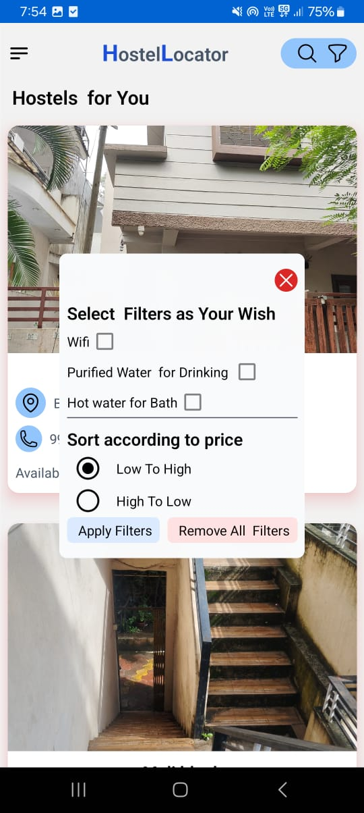

### 🧭 Drawer Navigation
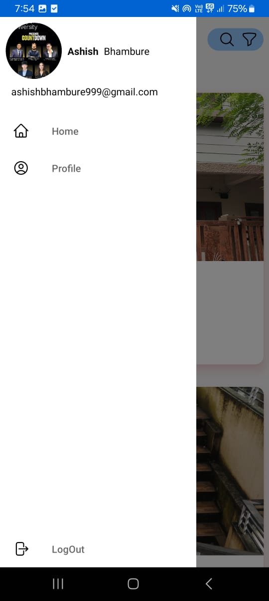

### 📋 Login & Signup
| Login | Signup |
|---|---|
| 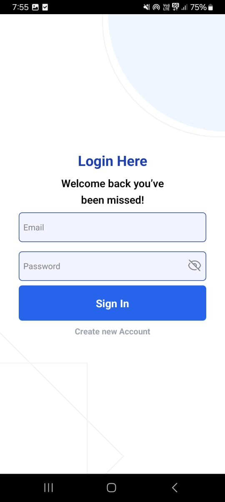 | 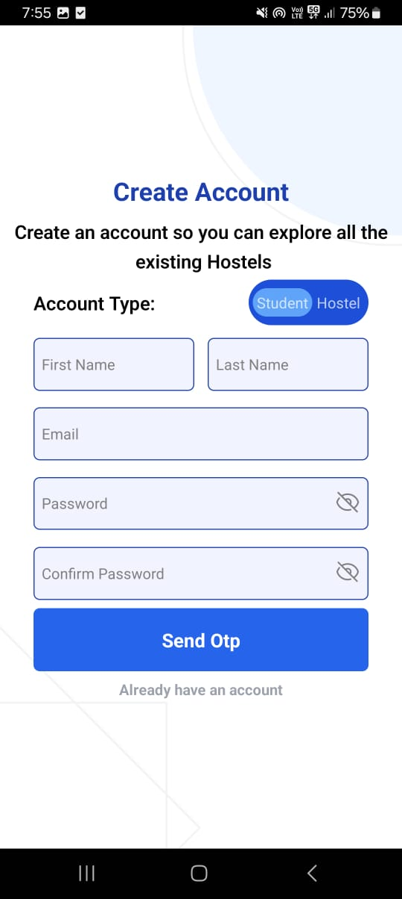 |

---

### 🔐 LogOut Confirmation
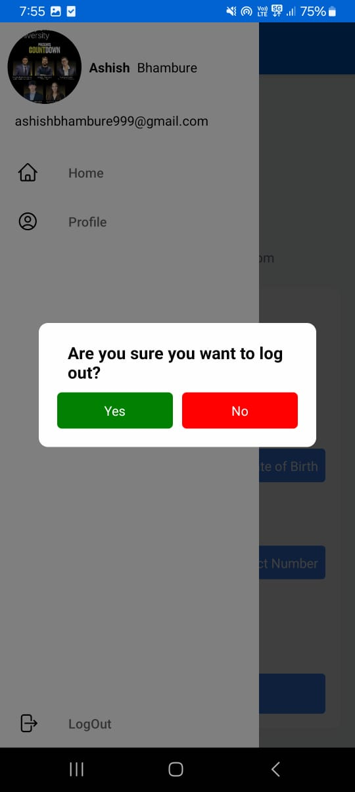

---

## 🏘️ Hostel Owner Panel

### 📥 Step-by-Step Hostel Registration
| Step 1 | Step 2 |
|---|---|
| 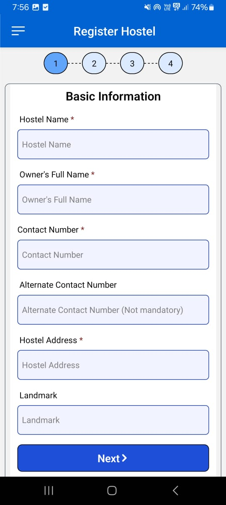 | 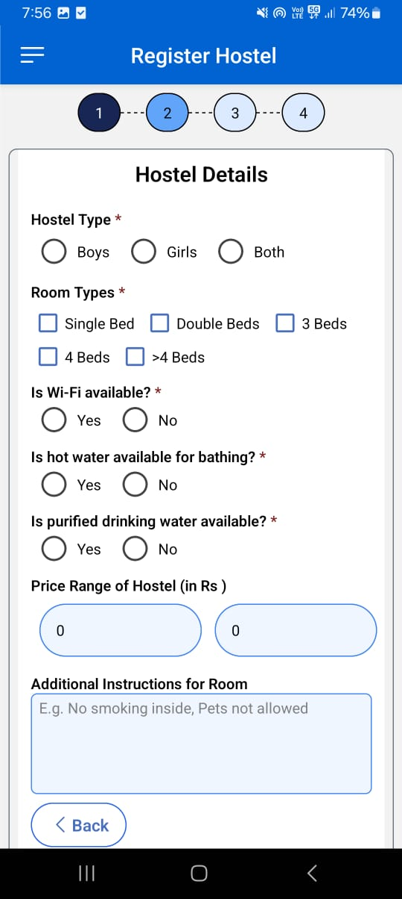 |

| Step 3 | Step 4 |
|---|---|
| 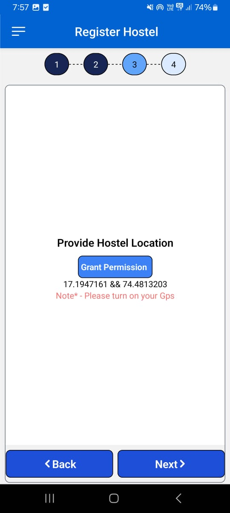 | 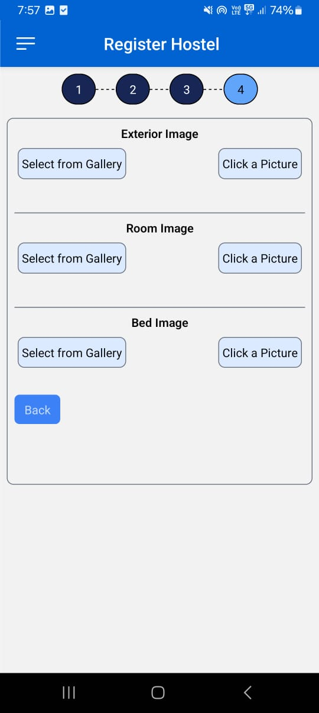 |

### 🖼️ Manage Hostel Gallery
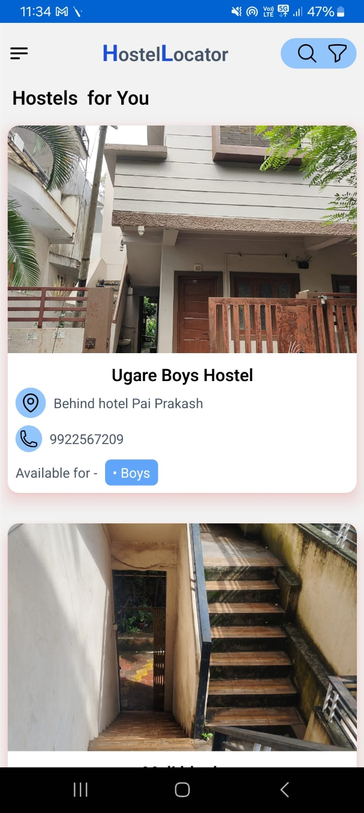

### 🛠️ Update Hostel Details
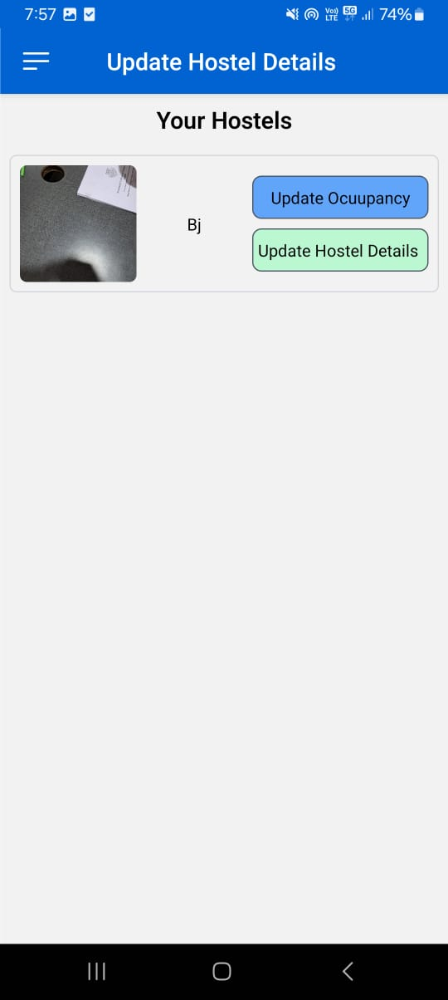

### 👥 Update Occupancy
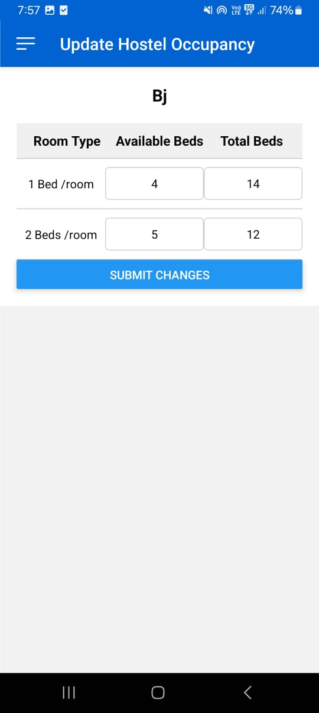

---

## 🔎 Additional Screens

### 👤 Profile Screen


### 🔍 Search Results
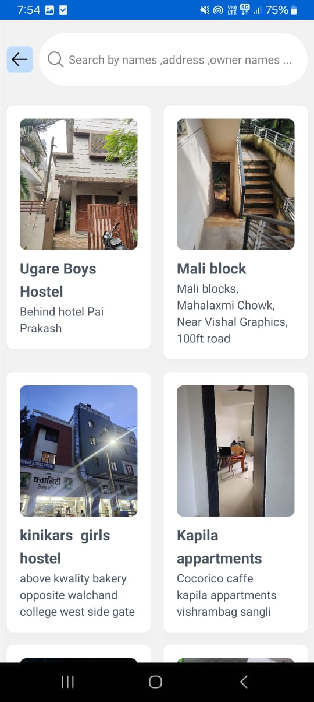

---

## 🛠️ Tech Stack

- ⚛️ **React Native**
- 🧾 **Redux (optional) / Context API**
- 🧩 **React Navigation**
- ☁️ **Node.js Backend (Express)**
- 🗃️ **MongoDB for Storage**

---

## 🚀 Getting Started

```bash
# Clone the repo
git clone https://github.com/yourusername/hostellocator.git

# Navigate to project directory
cd hostellocator

# Install dependencies
npm install

# Run on Android
npx react-native run-android

# Run on iOS (if on macOS)
npx react-native run-ios
